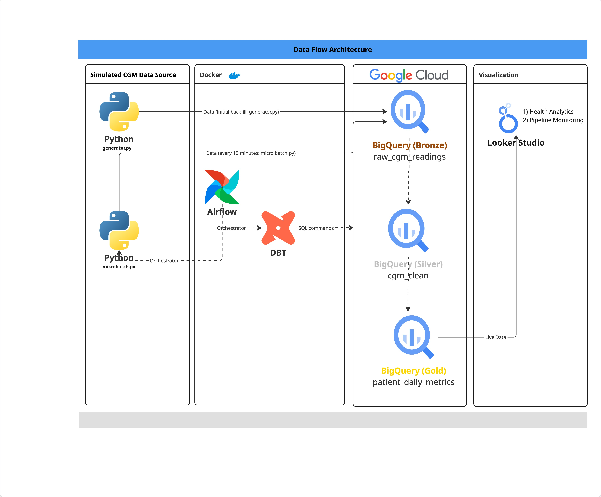

# 🩸 CGM Analytics Pipeline

**End-to-End Data Engineering Pipeline for Continuous Glucose Monitoring (CGM) Data**


---

## 📌 Overview

**CGM Analytics Pipeline** je robustní datová pipeline navržená pro zpracování, čištění a analýzu dat z kontinuálních monitorů glukózy (CGM).

Systém simuluje příjem dat v reálném čase (micro-batching), ukládá je do **Google BigQuery** a následně transformuje pomocí **dbt** do analytických modelů (Silver/Gold vrstvy). Celý proces je orchestrace pomocí **Apache Airflow**.

Cílem projektu je poskytnout škálovatelnou architekturu pro zpracování zdravotnických časových řad a výpočet klíčových metrik pro diabetiky (např. Time in Range, GMI, CV).

---

## 🎯 Kontext a cíl projektu

### Problém
Data z CGM senzorů přicházejí v obrovských objemech (měření každých 5 minut) a často obsahují chyby, výpadky signálu nebo šum. Pro efektivní léčbu diabetu je nutné tato data nejen spolehlivě ukládat, ale také čistit a agregovat do smysluplných denních metrik.

### Řešení
Tato pipeline automatizuje celý tok dat:
1.  **Ingestion**: Simulace generování dat pro 60 pacientů a jejich nahrávání do BigQuery.
2.  **Transformation**: Čištění dat a výpočet metrik (TIR, TBR, TAR) pomocí dbt.
3.  **Orchestration**: Pravidelné spouštění každých 15 minut pomocí Airflow.

> **Key Value Proposition**
> *"Automatizovaná pipeline transformuje surová data ze senzorů na klinicky relevantní metriky, což umožňuje lékařům a pacientům sledovat trendy kompenzace diabetu v téměř reálném čase."*

---

## ⚙️ Použité technologie

-   **Language**: Python 3.12
-   **Orchestration**: Apache Airflow (LocalExecutor)
-   **Transformation**: dbt (Data Build Tool)
-   **Data Warehouse**: Google BigQuery
-   **Containerization**: Docker & Docker Compose
-   **Libraries**: Pandas, NumPy, Google Cloud SDK

---

## 🏗️ Architektura systému (High-Level)

[](https://miro.com/app/board/uXjVG7n_SOA=/?share_link_id=68207993244)

*Klikněte na diagram pro otevření jeho interaktivní verze v Miro.*
---

## 🏗️ Struktura projektu

```
cgm-de-pipeline/
├── 📁 dags/                      # Airflow DAGs
│   └── cgm_pipeline_dag.py       # Hlavní pipeline (ingest + dbt)
├── 📁 dbt/cgm_dbt/               # dbt projekt
│   ├── 📁 models/
│   │   ├── 📁 staging/           # Silver vrstva (cgm_clean)
│   │   └── 📁 marts/             # Gold vrstva (patient_daily_metrics)
│   └── dbt_project.yml           # Konfigurace dbt
├── 📁 src/cgm_pipeline/          # Python zdrojové kódy
│   ├── 📁 ingest/                # Logika pro generování a nahrávání dat
│   │   ├── generator.py          # Simulátor CGM dat (pacienti, šum, jídlo)
│   │   └── microbatch.py         # Skript pro micro-batch load do BigQuery
├── 📁 scripts/                   # Pomocné skripty (backfill)
├── docker-compose.yml            # Definice služeb (Airflow, Postgres)
├── pyproject.toml                # Závislosti projektu
└── README.md                     # Dokumentace
```

---

## 🚀 Quick Start

### 1️⃣ Prerekvizity
-   Docker & Docker Compose
-   Google Cloud Platform účet + Service Account Key (JSON)
-   Python 3.12 (pro lokální vývoj)

### 2️⃣ Konfigurace prostředí
Vytvořte soubor `.env` nebo upravte proměnné v `docker-compose.yml`:
```bash
GCP_PROJECT=vas-gcp-project
BRONZE_DATASET=bronze
BRONZE_TABLE=raw_cgm_readings
```
Umístěte váš GCP klíč do `keys/gcp-sa.json`.

### 3️⃣ Spuštění infrastruktury
Spusťte Airflow a Postgres pomocí Docker Compose:
```bash
docker-compose up -d
```

### 4️⃣ Přístup k Airflow UI
Otevřete prohlížeč na `http://localhost:8080`.
-   **Username**: `admin`
-   **Password**: `admin`

Aktivujte DAG `cgm_pipeline_15_min`.

---

## 🧠 Modul 1: Data Ingestion (Micro-batch)

Skript `microbatch.py` simuluje data pro 60 pacientů.
-   **Logika**: Generuje data od posledního "watermarku" (uloženého v BigQuery) do aktuálního času.
-   **Vlastnosti dat**:
    -   Cirkadiánní rytmus
    -   Reakce na jídlo (snídaně, oběd, večeře)
    -   Náhodný šum a výpadky signálu
-   **Cíl**: Tabulka `raw_cgm_readings` (Bronze vrstva).

---

## 📊 Modul 2: dbt Transformations

Transformace probíhají ve dvou krocích:

### 1. Silver Layer (`cgm_clean`)
-   Odstranění duplicit.
-   Validace hodnot glukózy (rozsah 2.2 - 22.0 mmol/L).
-   Flagování chyb (např. `BELOW_SENSOR_RANGE`).

### 2. Gold Layer (`patient_daily_metrics`)
Agregace na úroveň **Pacient + Den**. Počítané metriky:
-   **Avg Glucose**: Průměrná glykémie.
-   **GMI / CV**: Glycemic Management Indicator, Coefficient of Variation.
-   **TIR (Time in Range)**: % času v cílovém rozmezí (3.9 - 10.0 mmol/L).
-   **TAR (Time Above Range)**: % času nad 10.0 mmol/L.
-   **TBR (Time Below Range)**: % času pod 3.9 mmol/L.

---

## 🔄 Tok dat

```
Generator (Python) → BigQuery (Bronze) → dbt BigQuery (Silver) → dbt BigQuery (Gold) → Reporting (Looker)
```

---

## 📄 Licence

Tento projekt slouží pro **demonstrační a vzdělávací účely** v oblasti Data Engineeringu.
Není určen pro klinické použití.
